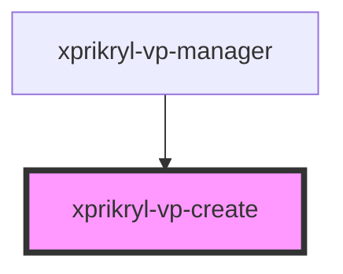

# xprikryl-vp-create

<!-- Auto Generated Below -->

## Properties

| Property  | Attribute  | Description | Type     | Default     |
| --------- | ---------- | ----------- | -------- | ----------- |
| `apiBase` | `api-base` |             | `string` | `undefined` |

## Events

| Event             | Description | Type                          |
| ----------------- | ----------- | ----------------------------- |
| `patient-created` |             | `CustomEvent<VirtualPatient>` |

## Dependencies

### Used by

 - [xprikryl-vp-manager](../xprikryl-vp-manager)

### Graph

----------------------------------------------

*Built with [StencilJS](https://stenciljs.com/)*
