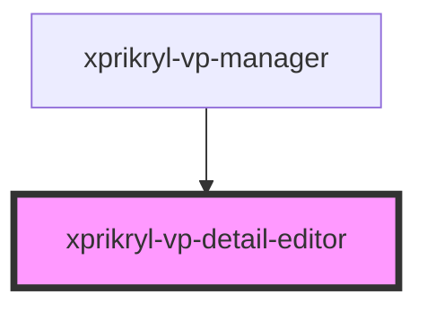

# xprikryl-vp-detail-editor

<!-- Auto Generated Below -->

## Properties

| Property    | Attribute    | Description | Type     | Default     |
| ----------- | ------------ | ----------- | -------- | ----------- |
| `apiBase`   | `api-base`   |             | `string` | `undefined` |
| `patientId` | `patient-id` |             | `string` | `undefined` |
| `userRole`  | `user-role`  |             | `string` | `undefined` |

## Events

| Event             | Description | Type                |
| ----------------- | ----------- | ------------------- |
| `patient-deleted` |             | `CustomEvent<void>` |
| `patient-updated` |             | `CustomEvent<any>`  |

## Dependencies

### Used by

 - [xprikryl-vp-manager](../xprikryl-vp-manager)

### Graph

----------------------------------------------

*Built with [StencilJS](https://stenciljs.com/)*
