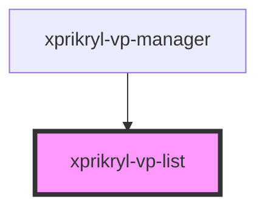

# xprikryl-vp-list

<!-- Auto Generated Below -->

## Properties

| Property   | Attribute   | Description | Type     | Default     |
| ---------- | ----------- | ----------- | -------- | ----------- |
| `apiBase`  | `api-base`  |             | `string` | `undefined` |
| `userRole` | `user-role` |             | `string` | `undefined` |

## Events

| Event           | Description | Type                  |
| --------------- | ----------- | --------------------- |
| `entry-clicked` |             | `CustomEvent<string>` |

## Dependencies

### Used by

 - [xprikryl-vp-manager](../xprikryl-vp-manager)

### Graph

----------------------------------------------

*Built with [StencilJS](https://stenciljs.com/)*
