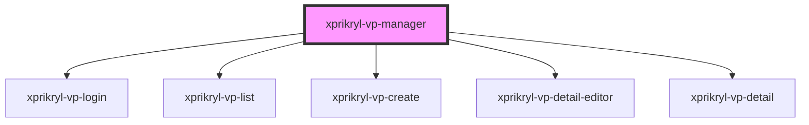

# xprikryl-vp-manager

<!-- Auto Generated Below -->

## Properties

| Property   | Attribute   | Description | Type     | Default     |
| ---------- | ----------- | ----------- | -------- | ----------- |
| `apiBase`  | `api-base`  |             | `string` | `undefined` |
| `basePath` | `base-path` |             | `string` | `undefined` |

## Dependencies

### Depends on

- [xprikryl-vp-login](../xprikryl-vp-login)
- [xprikryl-vp-list](../xprikryl-vp-list)
- [xprikryl-vp-create](../xprikryl-vp-create)
- [xprikryl-vp-detail-editor](../xprikryl-vp-detail-editor)
- [xprikryl-vp-detail](../xprikryl-vp-detail)

### Graph

----------------------------------------------

*Built with [StencilJS](https://stenciljs.com/)*
